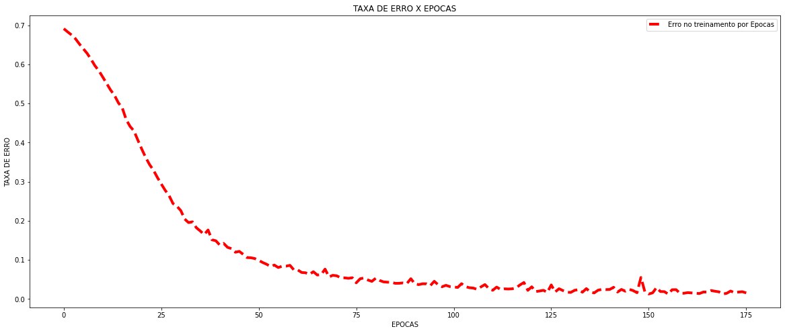
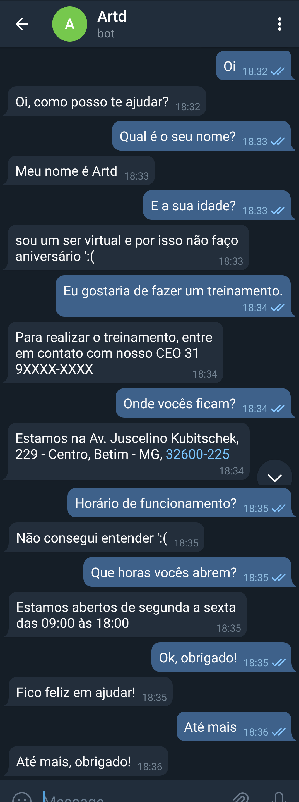

<H1>PROVA OFICIAL II DE SISTEMAS DISTRIBUÍDOS FAP - BETIM </H1>

Segunda prova bimestral da disciplina de Sistemas Distribuído do curso Ciência da Computação. Para este trabalho foi desenvolvido um chatBot que faz o uso da API do Telegram. Para isso foi utilizado o algoritmo de redes neurais artificiais que sera responsável por analisar a frase do emissor devidamente tratada e calculará a intensão, com a intenção calculada torna-se possível ir no banco de dados e localizar a resposta mais adequada para situação. Para mais detalhes consulte o Notebook.

<H2>ESTRUTURA DO MODELO </H2>

<H2>DESEMPENHO/TREINAMENTO</H2>

<H2>TESTE DO MODELO</H2>

